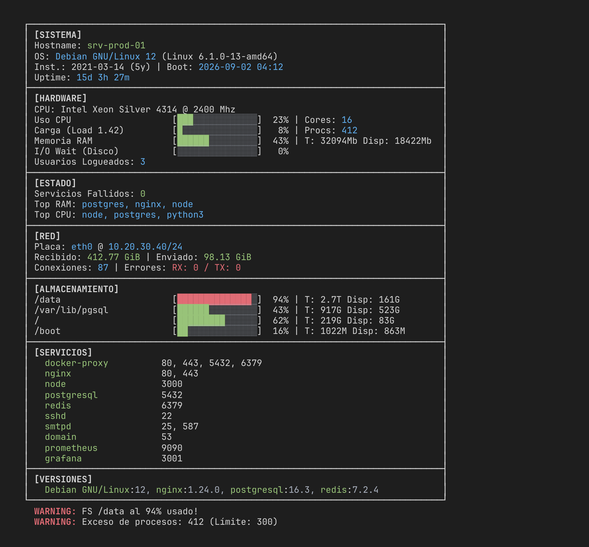

# stats.sh

A lightweight system information script, similar to `fastfetch` or `neofetch`, designed for quick server diagnostics, no externals commands.

<p align="center">
  
</p>

## Features
- **Visual Dashboard:** Clean, boxed layout with color-coded progress bars for CPU and RAM.
- **Service Monitoring:** Lists unique listening services (TCP/UDP) with their ports, automatically grouped and filtered (excluding loopback/multicast).
- **Robust OS Detection:** Accurately identifies installation date across multiple platforms:
  - **Cloud:** OpenStack, AWS, Azure, Google Cloud (via `cloud-init`).
  - **Virtualization:** oVirt, KVM, QEMU nodes.
  - **Linux Distros:** Arch, RHEL/CentOS, Debian/Ubuntu, CachyOS, and more.
- **Resource Alerts:** Real-time warnings (outside the box) for high load, disk space usage, or excess processes.
- **Legacy Compatibility:** Works on both modern systems and older versions (RedHat 5/6, etc.).

## Requirements

- `bash >= 3.2` and `awk` (any: gawk, mawk, busybox). Pure-POSIX awk, no extensions.
- Everything else degrades gracefully if missing:
  - listeners via `ss`, fallback to `netstat`;
  - primary interface via `ip`, fallback to `ifconfig`;
  - memory via `free`, fallback to `/proc/meminfo`.

## Quick run (no install)
```bash
curl -sSL https://raw.githubusercontent.com/kastormdz/stats.sh/master/stats.sh | bash
```

## Install
```bash
curl -sSL https://raw.githubusercontent.com/kastormdz/stats.sh/master/stats.sh -o /usr/local/bin/stats.sh
chmod +x /usr/local/bin/stats.sh
```

## Usage
Simply run the script:
```bash
./stats.sh
```

For Ansible/automation output (clean text):
```bash
./stats.sh -a
```

Machine-readable JSON (includes disks, services and versions):
```bash
./stats.sh -j
```

Fast mode (skips per-service versions and failed-services check):
```bash
./stats.sh --fast
```

All options: `-a/--ansible`, `-j/--json`, `-n/--no-color`,
`-w/--width N` (40-200), `-v/--verbose`, `-f/--fast`, `-h/--help`.
Legacy `./stats.sh 1` / `ansible` still works as `--ansible`.

## Authors
- **Cristian Gimenez** (cgimenez@gmail.com)
